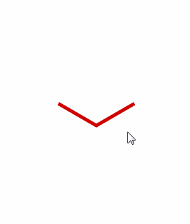

# add_Up_Down_stateInMaterialMenu
在别的大神基础上修改而成，原作请见[balysv/material-menu][1]
给MaterialMenu加入了向上的箭头，向下的箭头，加号

<p align="center">
  
</p>

</n>加入:一个是向上的箭头，一个是向下的箭头，可以在展开的时候使用，eclipse版，nineOld已经加入


License
-----------

```
Copyright 2014 Balys Valentukevicius

Licensed under the Apache License, Version 2.0 (the "License");
you may not use this file except in compliance with the License.
You may obtain a copy of the License at

   http://www.apache.org/licenses/LICENSE-2.0

Unless required by applicable law or agreed to in writing, software
distributed under the License is distributed on an "AS IS" BASIS,
WITHOUT WARRANTIES OR CONDITIONS OF ANY KIND, either express or implied.
See the License for the specific language governing permissions and
limitations under the License.
```

[1]:https://github.com/balysv/material-menu
